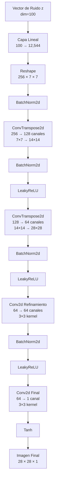
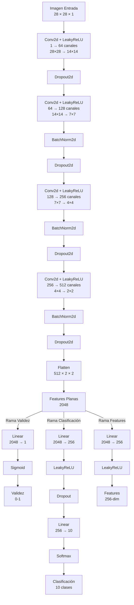

# GAN MNIST: Generación de Dígitos Manuscritos con Redes Generativas Adversarias

## Introducción Teórica

Las Redes Generativas Adversarias (GANs) representan uno de los avances más significativos en el campo del aprendizaje profundo en los últimos años. Introducidas por Ian Goodfellow y colaboradores en 2014, las GANs han revolucionado nuestra capacidad para generar datos sintéticos que imitan distribuciones de datos reales.

### Fundamentos de las GANs

Una GAN consiste en dos redes neuronales que compiten entre sí en un juego de suma cero:

1. **Generador (G)**: Aprende a crear datos sintéticos que parezcan reales.
2. **Discriminador (D)**: Aprende a distinguir entre datos reales y datos generados.

Estas redes se entrenan simultáneamente, donde:
- El generador intenta maximizar la probabilidad de que el discriminador cometa un error.
- El discriminador intenta minimizar su error de clasificación.

### GANs para Generación de Dígitos MNIST

En este proyecto, implementamos una GAN clásica con mejoras para generar imágenes de dígitos manuscritos similares a los del conjunto de datos MNIST. Nuestra implementación incluye varias mejoras sobre la GAN básica:

1. **Arquitectura Convolucional**: Utilizamos capas convolucionales tanto en el generador como en el discriminador para capturar mejor las estructuras espaciales.

2. **Clasificación Auxiliar**: Además de distinguir entre imágenes reales y falsas, nuestro discriminador también clasifica los dígitos (0-9), lo que mejora la calidad y diversidad de las imágenes generadas.

3. **Técnicas de Estabilización**: Implementamos varias técnicas para mejorar la estabilidad del entrenamiento, incluyendo:
   - Suavizado de etiquetas (Label smoothing)
   - Batch normalization
   - LeakyReLU
   - Dropout
   - Inicialización de pesos normal

## Arquitectura del Modelo

### Generador

El generador transforma un vector de ruido aleatorio (espacio latente) en una imagen de 28×28 píxeles. Su arquitectura está diseñada para aumentar progresivamente la resolución espacial mientras refina los detalles de la imagen.

#### Estructura del Generador



#### Detalles de Implementación

1. **Capa de Entrada**:
   ```python
   self.l1 = nn.Sequential(
       nn.Linear(latent_dim, 256 * 7 * 7)
   )
   ```

2. **Bloque Principal de Convoluciones**:
   ```python
   self.conv_blocks = nn.Sequential(
       nn.BatchNorm2d(256),
       
       # Primera capa de upsampling (7×7 → 14×14)
       nn.ConvTranspose2d(256, 128, 4, stride=2, padding=1),
       nn.BatchNorm2d(128),
       nn.LeakyReLU(0.2, inplace=True),
       
       # Segunda capa de upsampling (14×14 → 28×28)
       nn.ConvTranspose2d(128, 64, 4, stride=2, padding=1),
       nn.BatchNorm2d(64),
       nn.LeakyReLU(0.2, inplace=True),
       
       # Capa de refinamiento
       nn.Conv2d(64, 64, 3, stride=1, padding=1),
       nn.BatchNorm2d(64),
       nn.LeakyReLU(0.2, inplace=True),
       
       # Capa final
       nn.Conv2d(64, 1, 3, stride=1, padding=1),
       nn.Tanh()
   )
   ```

Cada componente de la arquitectura tiene un propósito específico:

- **ConvTranspose2d**: Realiza el upsampling espacial, duplicando las dimensiones espaciales
- **BatchNorm2d**: Estabiliza el entrenamiento normalizando las activaciones
- **LeakyReLU**: Permite gradientes pequeños para valores negativos (α=0.2)
- **Conv2d de Refinamiento**: Mejora los detalles locales sin cambiar las dimensiones
- **Tanh Final**: Normaliza la salida al rango [-1, 1]

### Discriminador

El discriminador analiza una imagen y produce tres salidas diferentes: validez de la imagen, clasificación del dígito y características de alto nivel. Esta arquitectura multi-tarea mejora la calidad del entrenamiento.

#### Estructura del Discriminador



#### Detalles de Implementación

1. **Bloque Convolucional Principal**:
   ```python
   self.conv_blocks = nn.Sequential(
       # 28x28 -> 14x14
       nn.Conv2d(channels, 64, 4, 2, 1),
       nn.LeakyReLU(0.2, inplace=True),
       nn.Dropout2d(0.25),
       
       # 14x14 -> 7x7
       nn.Conv2d(64, 128, 4, 2, 1),
       nn.BatchNorm2d(128),
       nn.LeakyReLU(0.2, inplace=True),
       nn.Dropout2d(0.25),
       
       # 7x7 -> 4x4
       nn.Conv2d(128, 256, 3, 2, 1),
       nn.BatchNorm2d(256),
       nn.LeakyReLU(0.2, inplace=True),
       nn.Dropout2d(0.25),
       
       # 4x4 -> 2x2
       nn.Conv2d(256, 512, 3, 2, 1),
       nn.BatchNorm2d(512),
       nn.LeakyReLU(0.2, inplace=True),
       nn.Dropout2d(0.25),
   )
   ```

2. **Ramas de Salida**:
   ```python
   # Rama de validez (real/falsa)
   self.adv_layer = nn.Sequential(
       nn.Linear(512 * 2 * 2, 1),
       nn.Sigmoid()
   )
   
   # Rama de clasificación (dígitos 0-9)
   self.aux_layer = nn.Sequential(
       nn.Linear(512 * 2 * 2, 256),
       nn.LeakyReLU(0.2, inplace=True),
       nn.Dropout(0.25),
       nn.Linear(256, 10),
       nn.Softmax(dim=1)
   )
   
   # Rama de características
   self.features_layer = nn.Sequential(
       nn.Linear(512 * 2 * 2, 256),
       nn.LeakyReLU(0.2, inplace=True)
   )
   ```

Cada componente tiene un propósito específico:

- **Conv2d + LeakyReLU**: Reduce dimensionalidad espacial mientras extrae características
- **BatchNorm2d**: Estabiliza el entrenamiento
- **Dropout2d**: Previene el sobreajuste
- **Sigmoid (rama validez)**: Normaliza la salida a probabilidad [0,1]
- **Softmax (rama clasificación)**: Genera distribución de probabilidad sobre los 10 dígitos
- **LeakyReLU (rama features)**: Mantiene características no lineales para matching

### El Uso de LeakyReLU

En nuestra implementación, utilizamos LeakyReLU como función de activación tanto en el generador como en el discriminador, en lugar de la ReLU tradicional. Esta elección no es arbitraria: mientras que ReLU simplemente anula todos los valores negativos (los convierte a cero), LeakyReLU permite un pequeño gradiente para estos valores negativos, típicamente con una pendiente de 0.2 en nuestro caso.

Esta característica es especialmente crucial en GANs, donde el aprendizaje depende fuertemente de la propagación de gradientes. El problema principal de ReLU es el fenómeno de "neuronas muertas", donde una neurona puede quedar permanentemente inactiva si aprende un sesgo que la lleva a producir siempre salidas negativas. Una vez que esto ocurre, el gradiente se vuelve cero y la neurona deja de aprender, efectivamente "muriendo".

LeakyReLU resuelve este problema permitiendo un pequeño flujo de gradientes incluso para valores negativos, manteniendo todas las neuronas activas durante el entrenamiento y mejorando la capacidad de la red para aprender representaciones más robustas. Esta característica es particularmente valiosa en el contexto de GANs, donde la estabilidad del entrenamiento es crucial para generar imágenes de alta calidad.

## Proceso de Entrenamiento

El entrenamiento de una GAN es un proceso delicado que requiere equilibrar el aprendizaje del generador y el discriminador. Nuestro enfoque incorpora varias técnicas para lograr un entrenamiento estable y efectivo.

### Hiperparámetros

Los hiperparámetros clave que controlan el comportamiento del modelo son:

- **Dimensión Latente (LATENT_DIM)**: 100
  - Tamaño del vector de ruido que el generador usa como entrada
  - Un valor suficientemente grande para permitir variedad en la generación

- **Tamaño de Lote (BATCH_SIZE)**: 128
  - Número de imágenes procesadas en cada iteración
  - Balance entre velocidad de entrenamiento y uso de memoria

- **Épocas (EPOCHS)**: 200
  - Número total de pasadas completas sobre el conjunto de datos
  - Suficientes para permitir la convergencia del modelo. Comentar que realmente con menos se han visto resultados semejantes.

- **Intervalo de Muestreo (SAMPLE_INTERVAL)**: 10
  - Cada cuántas épocas se generan imágenes de muestra
  - Permite monitorear visualmente el progreso del entrenamiento

- **Optimizador Adam**:
  - **BETA1**: 0.5
    - Tasa de decaimiento de primer orden
    - Valor típico para GANs, menor que el 0.9 estándar para mayor estabilidad
  - **BETA2**: 0.999
    - Tasa de decaimiento de segundo orden
    - Valor estándar que funciona bien en la práctica

- **Dispositivo (DEVICE)**:
  - Selección automática entre GPU (CUDA) y CPU
  - Optimiza el uso de recursos disponibles

### Directorios del Proyecto

- **IMAGES_DIR**: Almacena las imágenes generadas durante el entrenamiento
- **MODELS_DIR**: Guarda los checkpoints de los modelos
- **EVALUATION_DIR**: Contiene métricas y visualizaciones de evaluación
- **DATA_DIR**: Almacena el conjunto de datos MNIST

### Funciones de Pérdida

Nuestro modelo utiliza dos funciones de pérdida principales, cada una con un propósito específico:

#### Pérdida Adversarial (BCE)
La pérdida principal de nuestra GAN utiliza Binary Cross Entropy (BCE) para el juego adversarial entre generador y discriminador. Para mejorar la estabilidad, implementamos label smoothing en las etiquetas reales y falsas.

```python
# Definición de la pérdida
adversarial_loss = nn.BCELoss()

# Label smoothing
real_label = real_label * 0.9 + 0.1 * torch.rand_like(real_label)
fake_label = fake_label + 0.1 * torch.rand_like(fake_label)

# Pérdida del discriminador
d_real_loss = adversarial_loss(real_pred, real_label)
d_fake_loss = adversarial_loss(fake_pred, fake_label)
d_loss = d_real_loss + d_fake_loss + 0.5 * d_aux_loss

# Pérdida del generador
g_loss = adversarial_loss(fake_pred, real_label)
```

#### Pérdida Auxiliar de Clasificación
Esta pérdida adicional ayuda al discriminador a aprender características relevantes de los dígitos, mejorando indirectamente la calidad de las imágenes generadas. Utiliza Cross Entropy para la clasificación de los 10 dígitos.

```python
# Definición de la pérdida
auxiliary_loss = nn.CrossEntropyLoss()

# Pérdida auxiliar para el discriminador
d_aux_loss = auxiliary_loss(real_aux, labels)
```

La pérdida total del discriminador combina ambas pérdidas, dando un peso de 0.5 a la pérdida auxiliar para balancear su influencia. Esta combinación permite que el modelo no solo aprenda a distinguir entre imágenes reales y falsas, sino también a entender las características específicas de cada dígito.

### Algoritmo de Entrenamiento

El proceso de entrenamiento alterna entre actualizar el discriminador y el generador en cada iteración:

#### Entrenamiento del Discriminador
1. Procesar un lote de imágenes reales:
   - Calcular la pérdida adversarial real (BCELoss con label smoothing)
   - Calcular la pérdida auxiliar de clasificación (CrossEntropyLoss)
2. Generar imágenes falsas y calcular la pérdida adversarial falsa
3. Combinar las pérdidas: `d_loss = d_real_loss + d_fake_loss + 0.5 * d_aux_loss`
4. Actualizar los pesos del discriminador

#### Entrenamiento del Generador
1. Generar un nuevo lote de imágenes falsas
2. Calcular la pérdida adversarial usando BCELoss
3. Actualizar los pesos del generador

### Técnicas de Estabilización

Para mejorar la estabilidad del entrenamiento, implementamos las siguientes técnicas:

#### Suavizado de Etiquetas (Label Smoothing)
Utilizamos etiquetas suavizadas para prevenir que el discriminador se vuelva demasiado confiado:

```python
# Etiquetas suavizadas para imágenes reales
real_label = real_label * 0.9 + 0.1 * torch.rand_like(real_label)
# Etiquetas suavizadas para imágenes falsas
fake_label = fake_label + 0.1 * torch.rand_like(fake_label)
```

#### Inicialización de Pesos
Implementamos una inicialización específica para las capas de la red que ha demostrado funcionar bien en GANs:

```python
def weights_init_normal(m):
    classname = m.__class__.__name__
    if classname.find("Conv") != -1:
        torch.nn.init.normal_(m.weight.data, 0.0, 0.02)
    elif classname.find("BatchNorm") != -1:
        torch.nn.init.normal_(m.weight.data, 1.0, 0.02)
        torch.nn.init.constant_(m.bias.data, 0.0)
    elif classname.find("Linear") != -1:
        torch.nn.init.normal_(m.weight.data, 0.0, 0.02)
        if m.bias is not None:
            torch.nn.init.constant_(m.bias.data, 0.0)
```

#### Arquitectura Estabilizadora
- Uso de BatchNormalization en ambas redes
- LeakyReLU con pendiente de 0.2 para evitar neuronas muertas
- Dropout para prevenir sobreajuste

## Evaluación y Visualización

Para evaluar el rendimiento de nuestro modelo, utilizamos diversas métricas y visualizaciones que nos ayudan a entender su comportamiento.

### Métricas de Entrenamiento

Durante el entrenamiento, monitoreamos las siguientes métricas:

- **Pérdidas**:
  ```python
  print(f"[D loss: {d_loss.item():.4f}] [G loss: {g_loss.item():.4f}]")
  ```
  - Pérdida del Generador: Indica qué tan bien engaña al discriminador
  - Pérdida del Discriminador: Combina la capacidad de distinguir imágenes y clasificar dígitos

- **Precisiones**:
  ```python
  print(f"[D real acc: {d_real_acc_batch:.2f}] [D fake acc: {d_fake_acc_batch:.2f}] [Aux acc: {aux_acc:.2f}]")
  ```
  - Precisión en imágenes reales y falsas
  - Precisión en la clasificación de dígitos

### Visualizaciones Implementadas

1. **Imágenes Durante el Entrenamiento**:
   - Guardamos muestras cada `SAMPLE_INTERVAL` épocas
   - Permite ver la evolución de la calidad de generación

2. **Grid de Evaluación Final**:
   - Matriz de imágenes generadas (10x10)
   - Muestra la variedad de dígitos que puede generar el modelo

3. **Visualización t-SNE**:
   - Proyecta las características de imágenes reales y generadas
   - Ayuda a entender cómo el modelo distingue entre clases

4. **Matriz de Confusión**:
   - Evalúa la capacidad de clasificación del discriminador
   - Muestra patrones de error en la clasificación de dígitos

### Aplicación de Evaluación Interactiva

Hemos desarrollado una interfaz gráfica (app.py) que permite:
1. Generar nuevas imágenes aleatoriamente
2. Ver la predicción del discriminador (real/falsa)
3. Mostrar la clasificación del dígito
4. Mantener estadísticas de precisión del discriminador

Mencionar que es preferible usar el modo a pantalla completa.

## Espacio Latente y Generación

El espacio latente de dimensión 100 funciona como el "espacio creativo" del generador. Cada punto en este espacio corresponde a una imagen generada. En nuestro modelo, este vector de ruido aleatorio se transforma a través de una serie de capas hasta generar una imagen de 28×28 píxeles.

```python
# Generación de una imagen
z = torch.randn(1, LATENT_DIM, device=DEVICE)  # Vector de ruido aleatorio
generated_image = generator(z)                  # Imagen generada
```

## Desafíos y Soluciones Implementadas

### Estabilidad del Entrenamiento

**Problema**: El entrenamiento de GANs puede ser inestable, llevando a resultados pobres o divergencia.

**Soluciones implementadas**:
- Suavizado de etiquetas para prevenir que el discriminador se vuelva demasiado confiado
```python
real_label = real_label * 0.9 + 0.1 * torch.rand_like(real_label)
fake_label = fake_label + 0.1 * torch.rand_like(fake_label)
```
- Uso de BatchNormalization para estabilizar el entrenamiento
- LeakyReLU (α=0.2) para evitar el problema de neuronas muertas
- Inicialización de pesos específica para GANs
```python
def weights_init_normal(m):
    if isinstance(m, (nn.Conv2d, nn.ConvTranspose2d)):
        torch.nn.init.normal_(m.weight.data, 0.0, 0.02)
```

### Calidad de Generación

**Problema**: Generar imágenes de dígitos claras y variadas.

**Soluciones implementadas**:
- Arquitectura convolucional profunda con capas de upsampling progresivo
- Clasificación auxiliar para mejorar las características aprendidas
- Dropout en el discriminador para prevenir sobreajuste

Cabe mencionar que, con esta implementación, el conjunto de datos MNIST no requiere un número elevado de épocas de entrenamiento para obtener resultados razonablemente precisos. No obstante, si se trabajara con imágenes de mayor complejidad, el proceso de entrenamiento sería significativamente más exigente.

### Trabajo Futuro
Como mejora futura, se planea implementar una versión WGAN (Wasserstein GAN) con Penalización de Gradiente. Esta variante ofrece varias ventajas sobre el enfoque GAN clásico actual:
- Mayor estabilidad durante el entrenamiento
- Mejor convergencia
- Métricas más significativas para evaluar el progreso del entrenamiento
- Menor probabilidad de colapso modal
La implementación de WGAN-GP requerirá cambiar la función de pérdida actual (BCE) por la distancia de Wasserstein y añadir la penalización de gradiente, lo que teóricamente debería mejorar la calidad de 
los dígitos generados.

## Estructura del Proyecto

```
Improved_GAN/
├── config.py           # Configuración de hiperparámetros
├── data_loader.py      # Carga de datos
├── model.py            # Definición de modelos (Generator y Discriminator)
├── utils.py            # Funciones auxiliares
├── evaluation.py       # Funciones de evaluación
├── train.py            # Script de entrenamiento
├── app.py              # Aplicación de evaluación
├── requirements.txt    # Dependencias del proyecto
├── data/               # Directorio para datos
├── models/             # Directorio para modelos guardados
├── images/             # Directorio para imágenes generadas
└── evaluation/         # Directorio para resultados de evaluación

```

## Flujo de Trabajo

1. **Instalación**: 
   ```bash
   pip install -r requirements.txt
   ```
   - Se recomienda encarecidamente disponer de una GPU compatible con CUDA para el entrenamiento
   - El entrenamiento en CPU es posible pero significativamente más lento

2. **Configuración**: 
   - Ajustar hiperparámetros en `config.py` según necesidades
   - El código detectará automáticamente si hay GPU disponible:
   ```python
   DEVICE = torch.device("cuda" if torch.cuda.is_available() else "cpu")
   ```

3. **Entrenamiento**: 
   - Ejecutar `train.py` para entrenar los modelos
   - Se generarán visualizaciones periódicas en la carpeta `images/`
   - Los modelos se guardarán en `models/`

4. **Evaluación**: 
   - Utilizar `app.py` para evaluar interactivamente el modelo entrenado
   - Examinar las métricas y visualizaciones generadas en `evaluation/`


